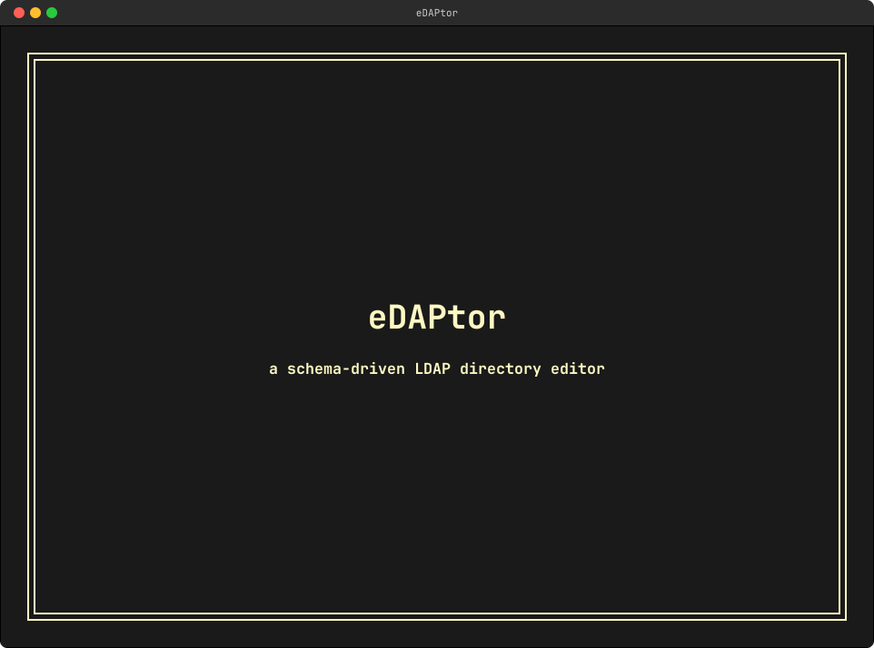

# eDAPtor

*The TUI LDAP editor* — a terminal UI for administering an OpenLDAP directory —
adding, modifying and removing **users** and **groups**, and managing **group
memberships** — built in Rust with [tvision-rs](https://github.com/oetiker/tvision-rs).

> The name is **e**ditor and L**DAP**, creatively merged.



*Screencast recorded with [ansidrama](https://github.com/oetiker/ansidrama), a
deterministic terminal-session → animated-WebP recorder.*

📖 **Documentation:** <https://oposs.github.io/edaptor>

## What makes it different

eDAPtor **derives the directory's structure from the LDAP server itself** via
full schema introspection (`cn=subschema`) and generates its edit forms
dynamically from `objectClass` definitions. A config file holds all connection
properties plus a small set of *entry profiles* describing what a "user" and a
"group" mean in your directory.

It is designed against the
[`oposs.openldap`](https://github.com/oposs) server configuration (OUs
`people`/`groups`/…, `groupOfNames` membership, the memberOf / refint / ppolicy
overlays, and the Samba schema).

## Status

**Working.** The core milestones are implemented on a three-pane tvision-rs
interface: schema-driven create/edit/rename/delete, defaults and auto-numbering,
inline passwords with the Samba lifecycle, unified candidate pickers, symmetric
membership editing, and **inline multi-value editing** (free-text and ordered
multi-value attributes are edited in place as a bulleted list — no modal). See
the [documentation](https://oposs.github.io/edaptor) for usage, and
`docs/superpowers/specs/` for the design specifications.

## Install

From the next release on, each release ships packages and archives; see the
[installation guide](https://oposs.github.io/edaptor/getting-started/installation.html).

```bash
# macOS and Linux, with Homebrew
brew tap oposs/edaptor https://github.com/oposs/edaptor
brew install edaptor

# Debian and Ubuntu
sudo install -d -m 0755 /etc/apt/keyrings
sudo curl -o /etc/apt/keyrings/gitea-oposs.asc https://gitea.oetiker.ch/api/packages/oposs/debian/repository.key
echo "deb [signed-by=/etc/apt/keyrings/gitea-oposs.asc] https://gitea.oetiker.ch/api/packages/oposs/debian stable main" | sudo tee /etc/apt/sources.list.d/oposs.list
sudo apt update && sudo apt install edaptor

# Fedora 41 and later
sudo dnf config-manager addrepo --from-repofile=https://gitea.oetiker.ch/api/packages/oposs/rpm.repo
sudo dnf install edaptor
```

Archives for Linux, macOS, illumos and Windows are on the
[releases page](https://github.com/oposs/edaptor/releases). `man edaptor` covers
the command line.

## Highlights of the design

- **Two-tier object model:** a generic schema-driven entry engine, with a
  pervasive *users & groups* understanding layered over it (passwords,
  memberships, Samba) that acts naturally across view/create/edit/delete/rename.
- **Responsive:** all LDAP I/O runs on a background worker thread; the UI never
  freezes on the network.
- **Safe & transparent:** immediate apply with an on-demand LDIF preview of the
  exact change.
- **Human-friendly:** `cn`-based labels everywhere (raw DNs only on demand);
  symmetric membership editing with incremental search on both panes.
- **Full Samba lifecycle:** client-side NT-hash, synced Unix+Samba passwords,
  SID discovered from the directory's `sambaDomain` entry.

## Local test server

`scripts/test-ldap.sh start` launches a podman OpenLDAP that mirrors the
`oposs.openldap` role — Samba + mail schemas, the memberOf/refint/ppolicy
overlays, password policies — and seeds it with ~600 users across 5 departments
and ~25 groups (see `scripts/ldap-provision/`). Point eDAPtor at it with:

```bash
scripts/test-ldap.sh start
export EDAPTOR_TEST_ADMIN_PW=adminpassword
edaptor --config examples/demo-config.toml
```

All generated users share the password `test123`.

## Configuration

A single TOML file (`--config <path>`, default `~/.config/edaptor/config.toml`)
declares the LDAP connection, how to authenticate, and a set of *entry profiles*
describing what a "user", "group", or "posixgroup" means in your directory. The
skeleton is:

```toml
[server]
uri          = "ldaps://ldap.example.com"
base_dn      = "dc=example,dc=com"
start_tls    = false
timeout_secs = 10

[auth]
method          = "simple"
bind_dn         = "cn=ldapmanager,dc=example,dc=com"
# Password is NEVER stored here. Sources: "prompt", "env:VAR", "command:cmd"
password_source = "prompt"
```

eDAPtor detects users, groups and their rules from the directory; `[[profile]]`
blocks only override what it got wrong, and `edaptor profiles` shows what it
detected.

This README intentionally stops here — the full, annotated reference lives in
the documentation rather than being duplicated:

- **[Profile Detection](https://oposs.github.io/edaptor/configuration/detection.html)**
- **[Entry Profiles](https://oposs.github.io/edaptor/configuration/entry-profiles.html)**
  and **[Defaults](https://oposs.github.io/edaptor/configuration/defaults.html)**
- **[Widgets](https://oposs.github.io/edaptor/configuration/widgets.html)** — the
  `[profile.widget.<attr>]` palette: `password`, `choice`, `lookup`, `picker`, `membership`
  (these replaced the former `[profile.picker]` / `[profile.password]` layers)
- **[Full Example](https://oposs.github.io/edaptor/configuration/full-example.html)**
  — the complete annotated `examples/config.toml`, copy-pasteable as a starting point

## License

[MIT](LICENSE) © Tobias Oetiker
