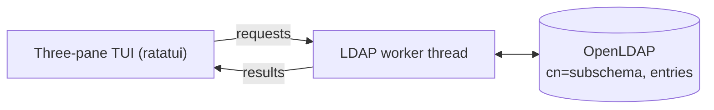

# Architecture

edaptor is built around two ideas that, together, make it feel responsive and
keep it portable across directories: **schema-driven forms** and a **background
LDAP worker**.

## Schema-driven forms

edaptor does not ship a hard-coded notion of what a "user" or a "group" looks
like. At startup it introspects the directory's own schema by reading
`cn=subschema`, then generates its edit forms **dynamically from the
`objectClass` definitions** of the entry being viewed.

Each `objectClass` declares its `MUST` and `MAY` attributes; the schema also
records each attribute's syntax and whether it is single- or multi-valued.
edaptor turns that information directly into form fields — required vs. optional,
scalar vs. multi-value, plain vs. masked — so the form always matches what the
server will actually accept.

The [configuration](../configuration/overview.md) file therefore declares
*intent* (what a user/group means, where to find them, how to label them) rather
than field layouts. When your directory's schema changes, the forms adapt
automatically; there is nothing to regenerate.

## Background LDAP worker

The terminal UI must never freeze while the network is slow. To guarantee that,
**all LDAP I/O runs on a dedicated worker thread.** The UI thread only renders
and handles keystrokes; it sends typed requests (search, read, add, modify,
rename, delete) to the worker over a channel and receives results back the same
way. The render loop polls for input on a short timeout and drains the worker's
responses each tick, so a search that takes seconds never blocks a keypress.

The TUI itself is built on [ratatui](https://ratatui.rs/) in a three-pane
layout; see [The Three-Pane TUI](../usage/three-pane.md) for the interface and
[Change Flow](change-flow.md) for how an edit becomes an LDAP operation.
