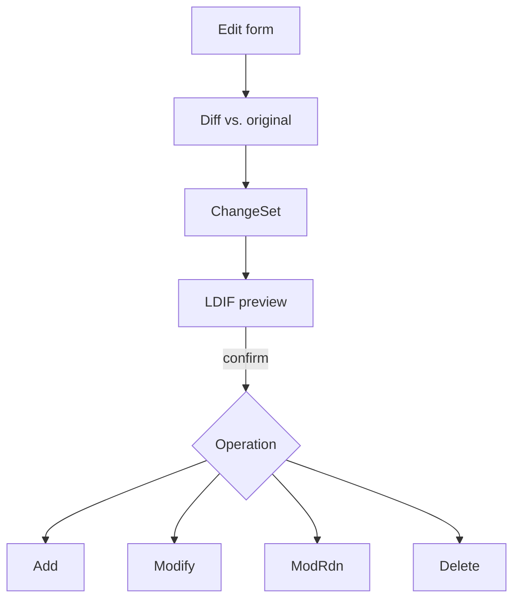

# Change Flow

Every modification you make in edaptor follows the same path: the edited form is
diffed against the entry as it was read, the difference becomes a **ChangeSet**,
and that ChangeSet is rendered as an **LDIF preview** of the exact change before
it is applied. Edits apply immediately on confirmation, but the LDIF preview is
always available on demand so nothing is sent to the directory blind.

## Diff vs. original

When you save, edaptor compares the form's current values to the values it read
from the server. Only genuine differences survive: a field you never touched
produces no change, and multi-valued attributes are compared **set-wise**, so
merely reordering values without adding or removing any yields no modification.

## ChangeSet → operation

The diff is collected into a ChangeSet, which maps to exactly one LDAP
operation:

- **Add** — a newly created entry.
- **Modify** — attribute add/delete/replace on an existing entry.
- **ModRdn** — a rename, when the RDN attribute changed.
- **Delete** — removing an entry.

## LDIF preview

Before the operation is sent, edaptor shows it as LDIF — the same change the
server will receive, in a format administrators already read. Passwords appear
masked as `********` in the preview even though the cleartext is what gets
written. Confirming applies the change; edaptor then re-reads the affected entry
so the view reflects reality (see
[LDAP Constraints](ldap-constraints.md#no-live-change-notification)).

For how these flows feel in practice — the dirty-guard before discarding edits,
rename as ModRdn, delete confirmation — see
[Creating, Editing, Renaming, Deleting](../usage/crud.md).
