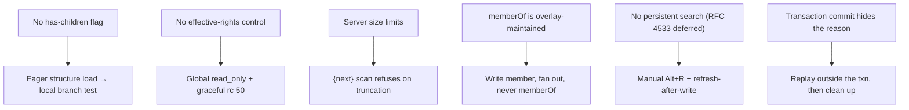

# LDAP Constraints

Several design choices in eDAPtor exist because of hard limits in LDAP and
OpenLDAP. Each constraint below maps to a concrete consequence in the UI.

## No cheap "has children" signal

LDAP gives no structural leaf/branch flag — *any* entry may have children, and
OpenLDAP does not enforce DIT structure rules by default. There is no
inexpensive way to ask "does this node have children?".

**Consequence:** eDAPtor **eagerly loads the directory structure** at startup
(DN plus a few label attributes), so "is this a branch?" becomes a free local
computation: a branch is simply an entry with at least one child. Create-child
is therefore offered on any entry.

## No per-entry rights introspection

OpenLDAP does not implement the *Get Effective Rights* control, so eDAPtor
cannot reliably ask, per entry, whether the bound identity may write it.

**Consequence:** instead of per-entry button hiding, eDAPtor uses a **global
`read_only` mode** (a [config flag](../configuration/server-auth.md), and/or an
anonymous bind) to suppress the write actions, and otherwise discovers the truth
at save time — handling `insufficientAccess` (result code 50) gracefully rather
than pretending to know in advance.

## Server size limits gate the auto-number scan

OpenLDAP's `olcSizeLimit` (default 500) silently truncates large result sets for
non-rootdn binds. That matters most for the `{next:MIN-MAX}` auto-number
[default](../configuration/defaults.md), which must scan existing values to find
the next free one.

**Consequence:** the auto-number scan **refuses to guess from a truncated
result.** If it detects that the directory scan was cut short by a size limit,
it stops and asks you to bind with a high-limit identity, rather than handing out
a value that may already be in use. (Scaling the eager structure load to large
directories via Simple Paged Results, RFC 2696, is design intent for big trees,
not yet a delivered guarantee.)

## Overlay-maintained `memberOf`

`memberOf` is **not** an attribute applications write; it is maintained by
OpenLDAP's `memberof` overlay as a back-reference to the forward `member`
attribute.

**Consequence:** eDAPtor **writes `member`, never `memberOf`.** When you tick a
group in a user's membership picker, eDAPtor fans the change out by adding (or
removing) that user's DN in the group's `member` attribute; the overlay then
updates `memberOf` on its own. See the
[`membership` widget](../configuration/widgets.md#the-membership-kind) for the
fan-out mechanism.

## No live change notification

OpenLDAP does not support Persistent Search. It *does* support RFC 4533 Content
Sync (syncrepl), which would allow eager-load plus live push in one operation —
the natural future upgrade for live tree updates — but that is **deferred**.

**Consequence:** eDAPtor does not assume the view is live. It refreshes on
demand (Alt+R) and re-reads automatically after each write, so what you see stays
consistent with what you just changed. Because the view can still be stale
between refreshes, a save can no longer assume the entry on the server matches
what you last read — see [Optimistic Concurrency](optimistic-concurrency.md)
for how eDAPtor detects and resolves that.

## A transaction hides why it failed

slapd checks the **schema** in the frontend, so a schema violation's explanation
arrives with the individual Add. **Overlay** checks — `unique`, `ppolicy` and
friends — are deferred to the commit. Inside an RFC 5805 transaction that means
every Add reports `err=0` and the EndTransaction reports the real failure with an
**empty diagnostic message**:

```
op=31 ADD dn="cn=cedric,ou=users,ou=groups,…"   err=0   text=
op=32 ADD dn="uid=cedric,ou=people,…"           err=0   text=
op=33 TXN END                                   err=19  text=
```

RFC 5805's `txnEndRes` carries only the failing operation's message ID, not its
message, so there is nothing further to read out of the response. The reason
exists on the server and is simply never sent.

**Consequence:** when a transaction is rejected without a message, eDAPtor
replays the same adds **outside** the transaction, where the server evaluates
them immediately and explains itself. The recovered reason is shown together with
the DN of the entry that failed. The replay only runs after a rollback, so the
directory holds none of the entries; it stops at the first failure and removes
whatever it created, and anything it cannot remove is named in the error rather
than left silently behind.


