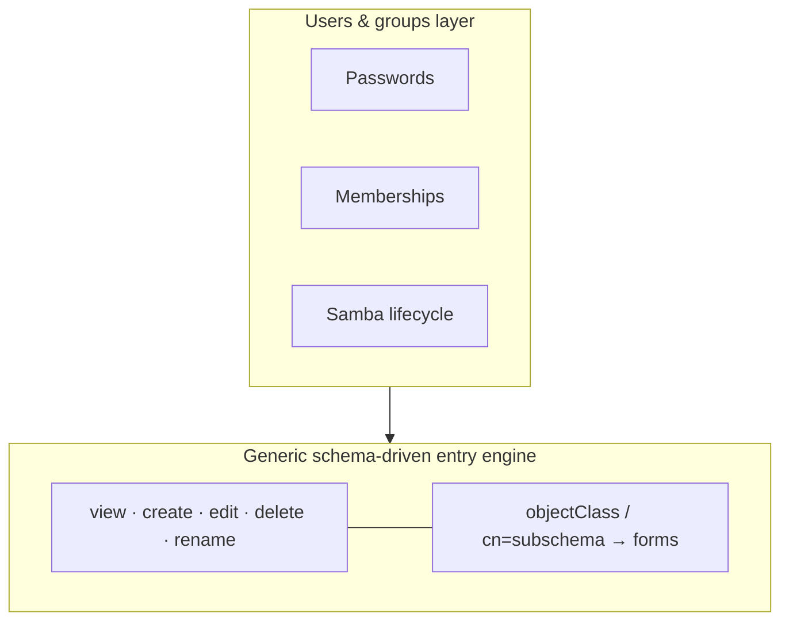

# Object Model

eDAPtor has a **two-tier object model**. At the base sits a generic,
schema-driven entry engine that knows nothing about users or groups. Layered
over it is a pervasive *users & groups* understanding that adds the domain
knowledge real administration needs — passwords, memberships, and the Samba
lifecycle.

## The base: a generic entry engine

The base engine treats every entry uniformly: a DN, a set of `objectClass`
values, and the attributes those classes permit (see
[Architecture](architecture.md)). From the live schema it can render any entry
as a form and apply the five core operations — **view, create, edit, delete,
rename** — without knowing what the entry *is*. This is what makes eDAPtor work
against an arbitrary directory: nothing here is specialised to a particular
schema.

## The layer: users & groups

On top of the generic engine, eDAPtor layers an understanding of the things
administrators actually manage. This layer is configured through
[entry profiles](../configuration/entry-profiles.md) and the sub-tables they
carry, and it acts *across all five operations* of the base engine:

- **Passwords** — an inline masked, confirm-twice field on create/edit, with
  cleartext written to the directory and `********` shown in the LDIF preview
  (see [Passwords](../configuration/passwords.md)).
- **Memberships** — [pickers](../configuration/pickers.md) that turn a candidate
  search into the right `member` / `memberUid` writes, including the fan-out that
  maintains overlay-driven back-references like `memberOf`.
- **Samba** — the full lifecycle (NT-hash, synced Unix+Samba passwords, SID from
  the directory's `sambaDomain`) enabled per profile.

Because the domain knowledge is a *layer* rather than a fork, the same generic
machinery drives both an ordinary entry and a richly-templated user account;
the layer only adds meaning where a profile asks for it.
